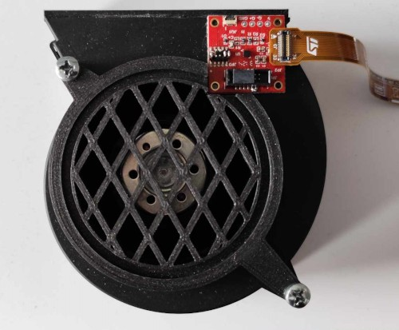

## 1 - Introduction

The air blower state recognition algorithm is intended for the DC centrifugal fan VHS0065XUFBS from ebmpapst. It recognizes the following states:
 * off (fan disconnected from the power source)
 * low-speed (fan connected to 12 V)
 * high-speed (fan connected to 15 V)
 * clogged (fan connected to 15 V and clogged with a filter)

A limited subset of data logs for this example is available [here](./datalogs/).

For information on how to integrate this algorithm in the target platform, please follow the instructions available in the README file of the [examples](../../) folder.

For information on how to create similar algorithms, please follow the instructions provided in the [tutorials](../../../tutorials) folder.

## 2 - Sensor configuration and placement

The accelerometer is configured with ±4 *g* full scale and 200 Hz output data rate.

The sensor must be placed as shown in the image below.

## 3 - Machine Learning Core configuration

Fourteen features are configured to be computed from the input accelerometer data (mean, variance, energy, peak-to-peak, minimum, maximum of the norm or the single axes).

The MLC runs at 200 Hz, computing features on windows of 51 samples (corresponding to 0.255 seconds).

One decision tree with 13 nodes has been configured to detect the different classes. A meta-classifier has been set to reduce false positives.

MLC1_SRC (34h) register values:
 * 1 = off
 * 2 = low-speed
 * 4 = high-speed
 * 8 = clogged

## 4 - Interrupts

The configuration generates an interrupt (pulsed and active high) on the INT1 pin every time the register MLC1_SRC (34h) is updated with a new value. The duration of the interrupt pulse is 5 ms in this configuration.

------

**More information: [http://www.st.com](http://st.com/MEMS)**

**Copyright © 2025 STMicroelectronics**
