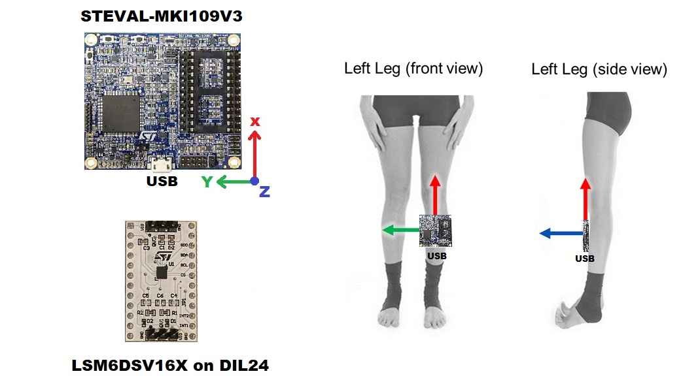
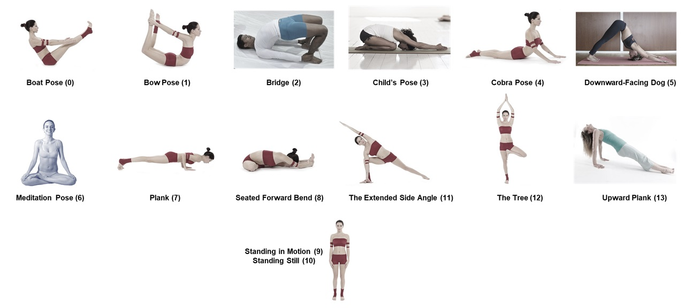

## 1 - Introduction

The Yoga Pose recognition algorithm described in this example is intended for wearable devices, since all the data logs have been acquired with the device placed on the left leg, with the orientation described in section 2. Fourteen different classes are recognized, as described in section 3.
A limited subset of data logs for this example is available [here](./datalogs/).

For information on how to integrate this algorithm in the target platform, please follow the instructions available in the README file of the [examples](../../) folder.

For information on how to create similar algorithms, please follow the instructions provided in the [tutorials](../../../tutorials) folder.

## 2 - Sensor configuration and orientation

The accelerometer is configured with ±2 *g* full scale and 120 Hz output data rate.

The [ProfiMEMS](https://www.st.com/en/evaluation-tools/steval-mki109v3.html) is placed on the left leg (see picture below). Other devices can be used as well, provided that the orientation of sensor axes is correct.

- X axis pointing up, toward the upper body.
- Y axis pointing toward the right leg.
- Z axis pointing forward.

*Source of images: Wikipedia. [Front view](https://commons.wikimedia.org/wiki/File:Tadasana_Yoga-Asana_Nina-Mel.jpg) and [Side view](https://commons.wikimedia.org/wiki/File:Chaturanga-Dandasana_low_Yoga-Asana_Nina-Mel.jpg).*

## 3 - Machine Learning Core configuration

The **Machine Learning Core (MLC)** is configured to run at 120 Hz, computing features on windows of 60 samples, therefore the Decision Tree classifier output is updated two times per second (120 Hz / 60 = 2 Hz).

Three different features are computed:

- Mean on accelerometer X axis
- Mean on accelerometer Y axis
- Mean on accelerometer Z axis

One decision tree with around 20 nodes has been configured to detect the different classes.
A meta-classifier has not been used.

The Decision Tree classifiers detects 14 different classes corresponding to 12 different Yoga positions (see picture below) and 2 Non-Yoga position (Standing still and in motion). The output of the Decision Tree classifier is stored in the register MLC1_SRC (address 70h).

- MLC1_SRC (70h) register values
  - 0 = Boat Pose
  - 1 = Bow Pose
  - 2 = Bridge
  - 3 = Child's Pose
  - 4 = Cobra's Pose
  - 5 = Downward-Facing Dog
  - 6 = Meditation Pose
  - 7 = Plank
  - 8 = Seated Forward Bend
  - 9 = Standing in Motion
  - 10 = Standing Still
  - 11 = The Extended Side Angle
  - 12 = The Tree
  - 13 =  Upward Plank

*Source of images: Wikipedia and Pixabay. [Boat Pose](https://en.wikipedia.org/wiki/File:Paripurna-Navasana_Yoga-Asana_Nina-Mel.jpg), [Bow Pose](https://commons.wikimedia.org/wiki/File:Tadasana_Yoga-Asana_Nina-Mel.jpg), [Bridge](https://commons.wikimedia.org/wiki/File:Setubandhasana_oblique_view.JPG), [Child's Pose](https://pixabay.com/it/photos/yoga-childs-posa-asana-2959214/), [Cobra Pose](https://commons.wikimedia.org/wiki/File:Bhujangasana_Yoga-Asana_Nina-Mel.jpg), [Downward-Facing Dog,](https://commons.wikimedia.org/wiki/File:Downward-Facing-Dog.JPG) [Meditation Pose](https://commons.wikimedia.org/wiki/File:Siddhasana_mulher.jpg), [Plank](https://commons.wikimedia.org/wiki/File:Chaturanga-Dandasana_low_Yoga-Asana_Nina-Mel.jpg), [Seated Forward Bend](https://commons.wikimedia.org/wiki/File:Janusirsasana_Yoga-Asana_Nina-Mel.jpg), [The Extended Side Angle](https://upload.wikimedia.org/wikipedia/commons/b/b5/Utthita-Parshvakonasana_Yoga-Asana_Nina-Mel.jpg), [The Tree](https://pl.m.wikipedia.org/wiki/Plik:Vriksasana_Yoga-Asana_Nina-Mel.jpg), [Upward Planck](https://commons.wikimedia.org/wiki/File:Putvottanasana_-_Upward_Plank_Pose_1_-_Diagonal_View.jpg), [Standing in Motion and Standing Still](https://commons.wikimedia.org/wiki/File:Tadasana_Yoga-Asana_Nina-Mel.jpg).*

## 4 - Interrupts

The configuration generates an interrupt (pulsed and active high) on the INT1 pin every time the register MLC1_SRC (70h) is updated with a new value. The duration of the interrupt pulse is 8.3 ms in this configuration.

------

**More Information: [http://www.st.com](http://st.com/MEMS)**

**Copyright © 2022 STMicroelectronics**
