# Tutorial 1 - Tools and data collection

The first step when starting to work with the MLC is to choose the right tools to develop your application. Below, you will find a summary of the hardware and software resources that facilitate the development of MLC solutions and will be employed throughout the tutorials.

STMicroelectronics provides a wide range of [sensors featuring the machine learning core (MLC)](https://www.st.com/content/st_com/en/ecosystems/MEMS-Sensors-Ecosystem-for-Machine-Learning.html). In these tutorials, the [LSM6DSV16X](https://www.st.com/en/mems-and-sensors/lsm6dsv16x.html) sensor will serve as a reference example, though the guidance is applicable to other MLC-equipped sensors as well.

## Hardware

### [NUCLEO-F401RE](https://www.st.com/en/evaluation-tools/nucleo-f401re.html) + [X-NUCLEO-IKS4A1](https://www.st.com/en/ecosystems/x-nucleo-iks4a1.html)

The `Nucleo F401RE` is a development board from STMicroelectronics, designed to provide a flexible and cost-effective platform for developing applications. It is part of the STM32 Nucleo family, which offers a wide range of compatible boards and expansion options.

The `X-NUCLEO-IKS4A1` is a motion MEMS and environmental sensor evaluation board kit consisting of the main board X-NUCLEO-IQS4A1, which hosts the motion MEMS and environmental sensors, and the detachable add-on board STEVAL-MKE001A, which hosts the Qvar swipe electrodes.

This expansion board also gives the possibility to develop applications using the sensor hub feature, allowing to connect other sensors to the LSM6DSV16X sensor for processing in the MLC.

Built-in sensors:
- `LSM6DSV16X`, LSM6DSO16IS, `LIS2MDL`, LIS2DUXS12, LPS22DF, SHT40AD1B, STTS22H

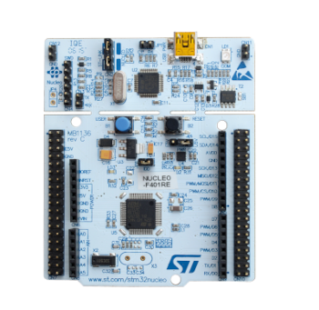
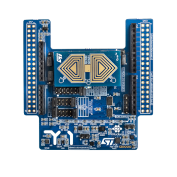

Documentation:
- [STM32 Nucleo-64 boards user manual](https://www.st.com/resource/en/user_manual/um1724-stm32-nucleo64-boards-mb1136-stmicroelectronics.pdf)
- [X-NUCLEO-IKS4A1 data brief](https://www.st.com/resource/en/data_brief/x-nucleo-iks4a1.pdf)
- [X-NUCLEO-IKS4A1 user manual](https://www.st.com/resource/en/user_manual/um3239-getting-started-with-the-xnucleoiks4a1-motion-mems-and-environmental-sensor-expansion-board-for-stm32-nucleo-stmicroelectronics.pdf)

### [LSM6DSV16X DIL24 adapter board (STEVAL-MKI227KA)](https://www.st.com/en/evaluation-tools/steval-mki227ka.html)

Adapter board for the LSM6DSV16X sensor, which embeds a 3-axis accelerometer, a 3-axis gyroscope, electrostatic sensor (Qvar), and the machine learning core (MLC), capable of running decision tree models. The adapter board must be plugged into the DIL24 socket of the mother board.

This is not necessary if using boards that already have the LSM6DSV16X sensor on-board (X-NUCLEO-IKS4A1 and SensorTile.box PRO).

A full set of DIL24 adapter boards is available for all ST MEMS sensors: https://www.st.com/en/evaluation-tools/mems-motion-sensor-eval-boards.html

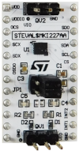

Documentation:
- [Datasheet](https://www.st.com/resource/en/datasheet/lsm6dsv16x.pdf)
- [Application note for MLC](https://www.st.com/resource/en/application_note/an5804-lsm6dsv16x-machine-learning-core-stmicroelectronics.pdf)

### [Professional MEMS tool (STEVAL-MKI109D)](https://www.st.com/en/evaluation-tools/steval-mki109d.html)

STM32 plug-and-play evaluation board compatible with all the ST MEMS sensors via DIL24 adapter. See what the Professional MEMS tool (ProfiMEMS) is capable of in cooperation with MEMS Studio in this [video](https://youtu.be/3NdEGRuV0eM).

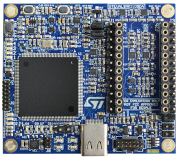

Documentation:
- [Data brief](https://www.st.com/resource/en/data_brief/steval-mki109d.pdf)
- [User manual](https://www.st.com/resource/en/user_manual/um3420-stevalmki109d-professional-mems-tool-motherboard-for-mems-adapter-boards-stmicroelectronics.pdf)

### [SensorTile.box PRO (STEVAL-MKBOXPRO)](https://www.st.com/en/evaluation-tools/steval-mkboxpro.html)

Ready-to-use programmable wireless kit for developing any IoT application based on remote data gathering and evaluation. Exploit the full kit potential by leveraging both motion and environmental data sensing, along with a digital microphone, and enhance the connectivity and smartness of whatever environment you find yourself into. There is no need for an external DIL24 adapter board as the LSM6DSV16X sensor is already integrated.

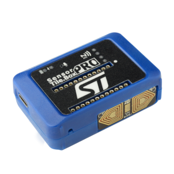

Documentation:
- [Data brief](https://www.st.com/resource/en/data_brief/steval-mkboxpro.pdf)
- [User manual](https://www.st.com/resource/en/user_manual/um3133-getting-started-with-sensortilebox-pro-multisensors-and-wireless-connectivity-development-kit-for-any-intelligent-iot-node-stmicroelectronics.pdf)

### [STWIN.box (STEVAL-STWINBX1)](https://www.st.com/en/evaluation-tools/steval-stwinbx1.html)

A development kit and reference design that simplifies prototyping and testing of advanced industrial sensing applications in IoT contexts such as condition monitoring and predictive maintenance. The LSM6DSV16X sensor can be connected through the flexible cable and the adapter board for DIL24 sensors.

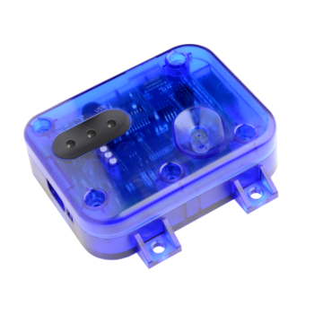

Documentation:
- [Data brief](https://www.st.com/resource/en/data_brief/steval-stwinbx1.pdf)
- [User manual](https://www.st.com/resource/en/user_manual/um2965-getting-started-with-the-stevalstwinbx1-sensortile-wireless-industrial-node-development-kit-stmicroelectronics.pdf)

## Software

### [MEMS Studio](https://www.st.com/en/development-tools/mems-studio.html)

A complete desktop software designed to develop embedded AI solutions, leveraging the machine learning core (MLC), evaluate embedded libraries, analyze data, and design no code algorithms for the entire portfolio of MEMS sensors. MEMS Studio is part of the [ST Edge AI Suite](https://www.st.com/content/st_com/en/st-edge-ai-suite.html) which is an integrated collection of software tools, designed to facilitate the development and deployment of embedded AI applications.

### [ST BLE Sensor application](https://www.st.com/en/embedded-software/stblesensor.html)

The ST BLE Sensor application is available for Android and iOS and shows the data exported by a BLE device using the BlueST protocol. The app shows different panels based on the data types exported by the firmware, including: environmental data, MEMS sensor fusion, plot, activity recognition, carry position, acceleration event, BlueVoice, compass, cloud logging, high speed data log, smart motor control, node status.

### [ST AIoT Craft](https://staiotcraft.st.com/index.html)

An online tool to fast-track the development of sensor-to-cloud solutions leveraging ST components with in-sensor AI. ST AIoT Craft collects labelled sensor data and uses it to train the models for the MLC. The result can be validated using ST evaluation boards either from the web portal or from the companion mobile app.

## Data collection tools

Every machine learning core project starts with the collection of data for each class to recognize. In order to train a robust model, a good amount of data should be collected for each class, covering as much as possible all the possible variability (due to different users, different scenarios, etc.). Every datalog should also be long enough so that the pattern is clear and repeats multiple times. In this section, you will find some data logging options using ST's ecosystem.

### Professional MEMS tool & MEMS Studio

This example provides a step-by-step tutorial on how to collect data with the `Professional MEMS tool` board, the `STEVAL-MKI227KA` DIL24 adapter of the LSM6DSV16X sensor and `MEMS Studio`. Find out how to connect and configure your hardware and save your logged data to a file for further use.

1. Connect the ProfiMEMS board with the LSM6DSV16X sensor

    Plug the STEVAL-MKI227KA sensor adapter into the DIL24 socket on the top of the ProfiMEMS board and connect the board to your PC with a USB cable.

2. Open MEMS Studio and connect it to the board

    After opening MEMS Studio, the user is asked to update the firmware of the ProfiMEMS board if it is not up-to-date. After flashing the newest firmware, click on the `Connect` button. When the board is connected, the app shows details about the connected board on the right side. On the left side the user is required to select which device is connected to the ProfiMEMS board: in this example, choose STEVAL-MKI227KA (LSM6DSV16X) and click on `Select`.

    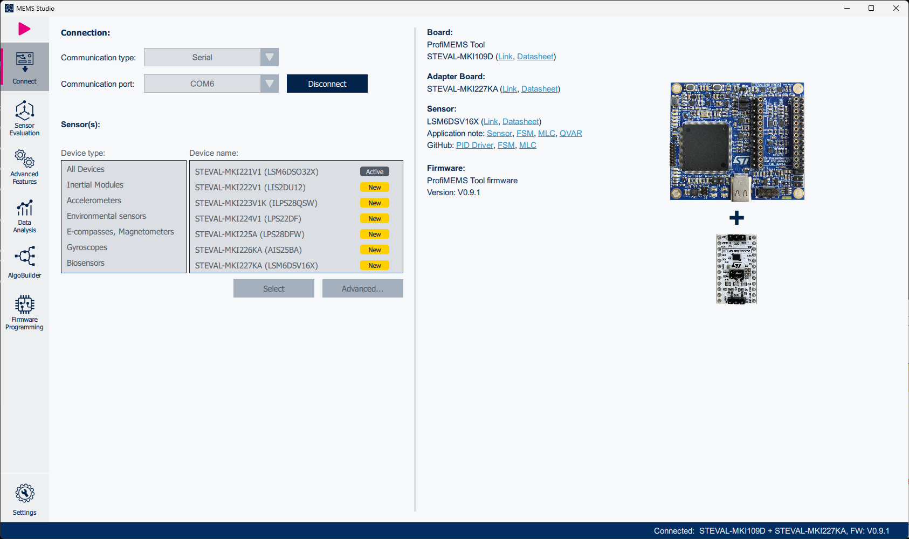

3. Sensor evaluation

    After the succesful connection, MEMS Studio jumps to `Quick setup` inside `Sensor Evaluation`, where the LSM6DSV16X sensor can be configured. An *Easy Configuration* option is available to set a default configuration for the sensors, or the user can directly configure both the *Output Data Rate* and *Full Scale* settings for both accelerometer and gyroscope.

    The accelerometer configuration for this example is the following:
    - Full Scale: 8 g
    - Output Data Rate: 30 Hz (High Performance mode)

    Since we need only the accelerometer, set the gyroscope in power-down mode and turn Qvar off. It is possible to save this configuration in a `JSON` file in the `Load/Save Configuration` tab to re-use it in the next tutorials. A reference file is available in the *sensor_configuration* folder of this tutorial.

    After the successful sensor configuration press the `▶` button in the top left corner to start streaming data from the sensor.

    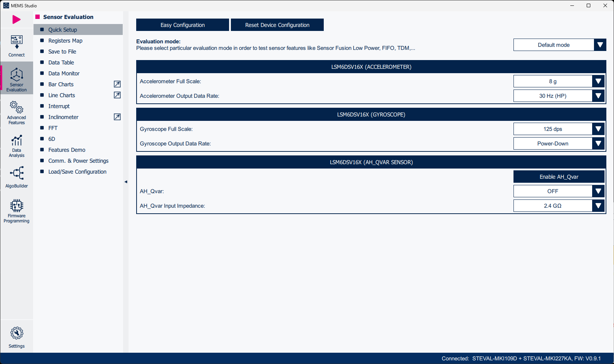

    Note: For further sensor configuration, it is possible to configure the sensor using `Registers Map`, which allows direct writing to the sensor registers.

4. Save to file

    Open the `Save to File` tab. Click on `Browse` and add a path where you want to save the data file. In the `Data` section
    select the type of data you want to save. In our example we only need  *Accelerometer* data. From the moment the `Start` button is pressed, MEMS Studio will save the data until the user presses the `Stop` button. Data logging is also indicated by a red dot with actual logging time in the bottom bar of the application.

    In case the user needs a precise time period of data, it is possible to set the `Timeout value`.

    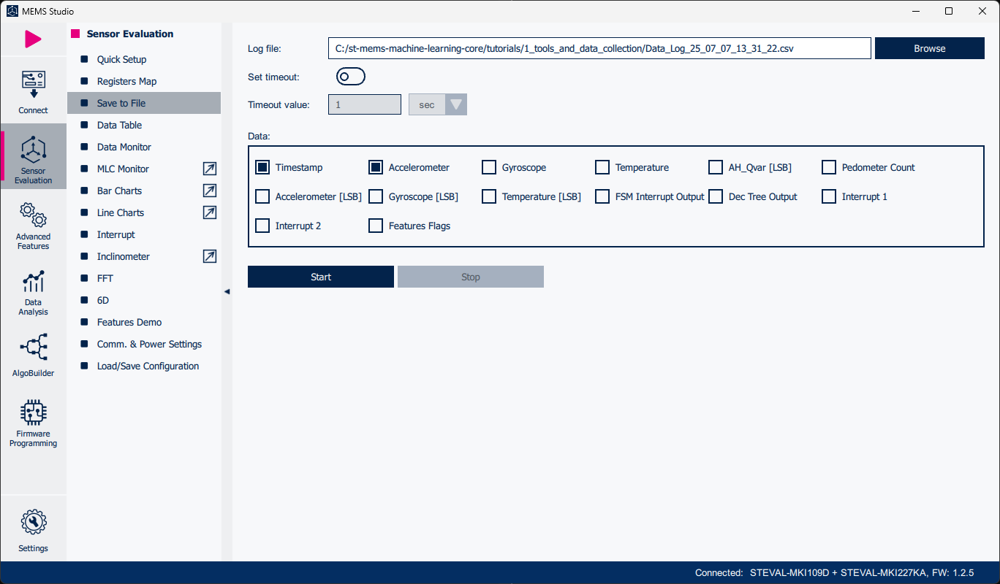

5. Data visualization

    For better control over the data collected, open the `Line Charts` tab with `Motion` page.

    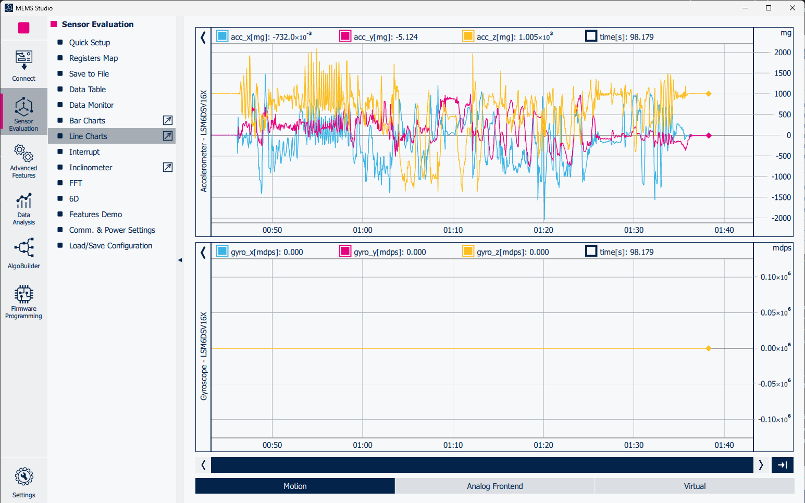

### NUCLEO-F401RE + X-NUCLEO-IKS4A1 & MEMS Studio

This example demonstrates how colllect data with the `NUCLEO-F401RE` board and the `X-NUCLEO-IKS4A1` expansion board with the LSM6DSV16X sensor using `MEMS Studio`. Find out how to connect and configure your hardware and save your logged data to a file for further use.

1. X-NUCLEO-IKS4A1 hardware configuration

    The LSM6DSV16X sensor is already on the X-NUCLEO-IKS4A1 board. However, it is necessary to have the jumpers correctly configured. We will use configuration `Mode 1: standard I2C bus connection (all sensors)`. Details can be found in section 3.2 of the user manual [UM3239](https://www.st.com/resource/en/user_manual/um3239-getting-started-with-the-xnucleoiks4a1-motion-mems-and-environmental-sensor-expansion-board-for-stm32-nucleo-stmicroelectronics.pdf).

    The board configuration is:
    - J4: 1-2, 11-12 (STM_SDA = SENS_SDA, HUB_SDx = GND)
    - J5: 1-2, 11-12 (STM_SCL = SENS_SCL, HUB_SCx = GND)

    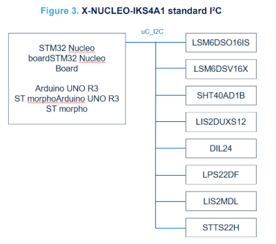

2. Plug the X-NUCLEO-IKS4A1 expansion board and connect the NUCLEO-F401RE to your PC with a USB cable

3. Flashing firmware

    When the hardware configuration of the X-NUCLEO-IKS4A1 expansion board is done, the next step is to flash the firmware for the NUCLEO-F401RE board. Download the [X-CUBE-MEMS1](https://www.st.com/en/embedded-software/x-cube-mems1.html#get-software) package, which contains already prebuilt binaries.

    From the X-CUBE-MEMS1 package we will use the **DataLogExtended** firmware, that can be found under *Projects\NUCLEO-F401RE\Examples\IKS4A1\DataLogExtended\Binary\DataLogExtended\Binary*.

    Open the **Firmware Programming** tool in MEMS Studio, click on `Browse` and select the *DataLogExtended.bin* file. When the desired file is selected, start programming clicking on the `Program` button.

4. Connect the NUCLEO-F401RE board to MEMS Studio

    With the firmware successfully flashed it is time to connect the Nucleo board to MEMS Studio. After clicking on the `Connect` button, choose the sensors from the X-NUCLEO-IKS4A1 expansion board. In our case make sure you have chosen LSM6DSV16X as *Accelerometer*. Then click on `Select`.

    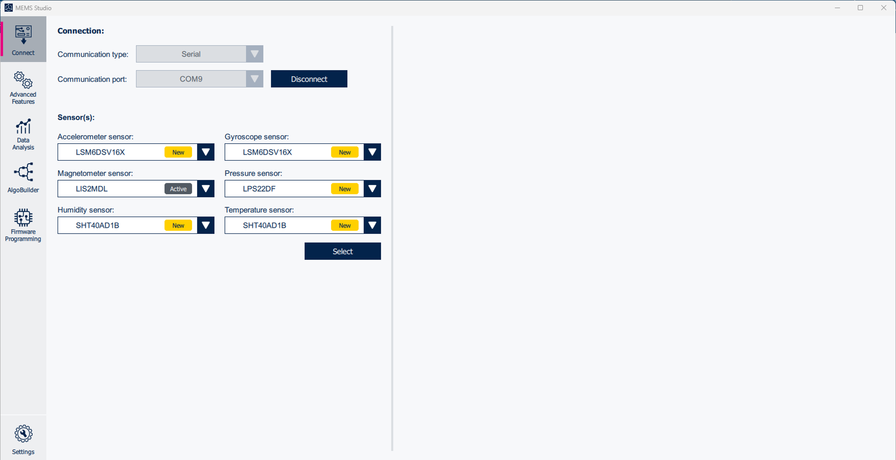

5. Sensor configuration

    After the sensors have been selected, go to the `Sensor Evaluation` tab. Configure the sensor with `Quick Setup` or use `Register Map` for advanced configuration possibilities.

    It is possible to save the sensor configuration in a `JSON` file in the `Load/Save Configuration` tab to re-use it in the next tutorials. A reference file is available in the *sensor_configuration* folder of this tutorial.

    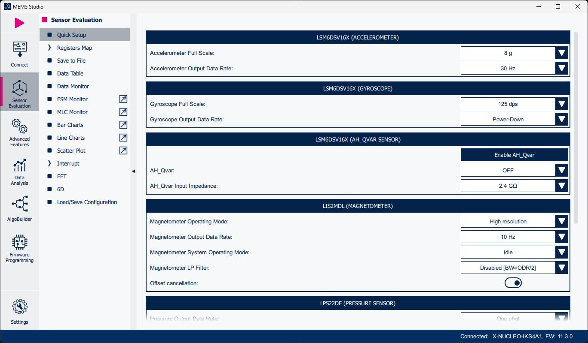

6. Data logging

    After the sensor configuration, go to the `Save to File` tab. Click on `Browse` and select a folder where datalogs will be saved. Then choose what kind of data you want to save (*Accelerometer* in this example). Make also sure to set the *Datalog period source* to *Accelerometer* in order to log data synchronously with the sensor data generation signal; this is important to mimic how the data is fed to the MLC. To start collecting data simply click onn the `Start` button. To stop collecting data click on the `Stop` button.

    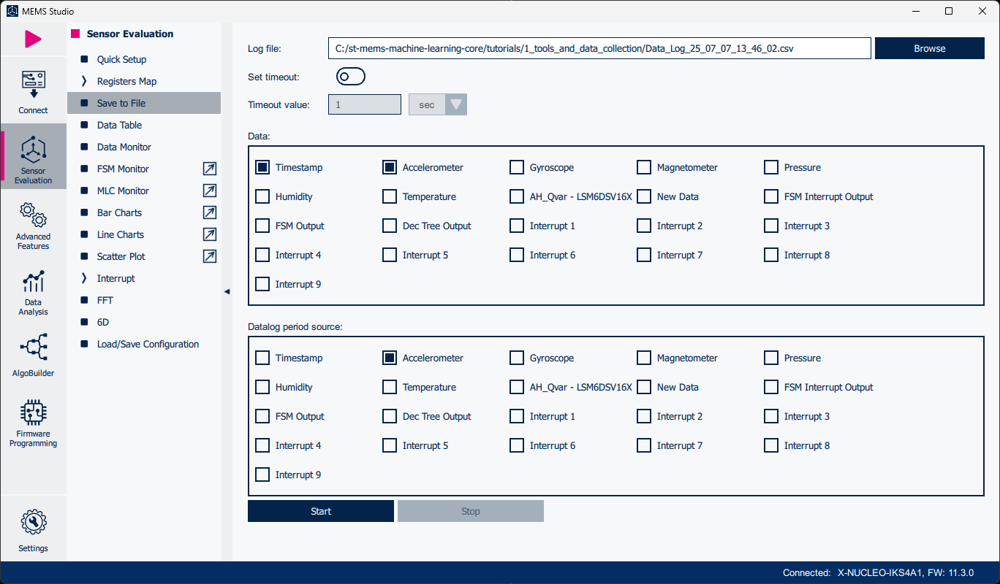

7. Data visualization

    For better control over the data collected, open the `Line Charts` tab with `Motion` page.

    

### SensorTile.Box PRO / STWIN.box & ST BLE Sensor application

This example requires the `STEVAL-MKBOXPRO` / `STEVAL-STWINBX1` board and `ST BLE Sensor` application downloaded on your mobile device. In this case it is necessary to download the [`ST High Speed Datalog`](https://www.st.com/en/embedded-software/fp-sns-datalog2.html) firmware.

1. Connect the SensorTile.Box PRO / STWIN.box to the ST BLE Sensor app

    Turn on the SensorTile.Box PRO / STWIN.box and open ST BLE Sensor app. Available boards will show up in the main page. In case you do not see your board in the list, try to refresh the app with the button in the middle bottom or adjust the filter. Connect to the board simply by clicking on the board widget.

    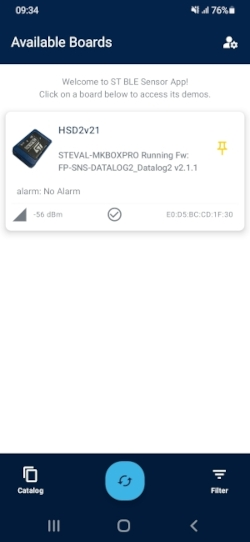

2. Flash High Speed Datalog firmware

    After the connection is established make sure to flash `High Speed Datalog` firmware if not already flashed.
    - Click on `Settings` button in top right corner.
    - Select the `FP-SNS-DATALOG2` firmware binary from your mobile device.
    - Click on `UPGRADE`.
    - The app automaticaly looks for an update of your firmware in case the current one is outdated.

    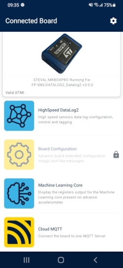
    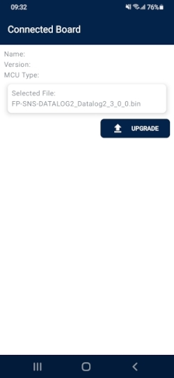
    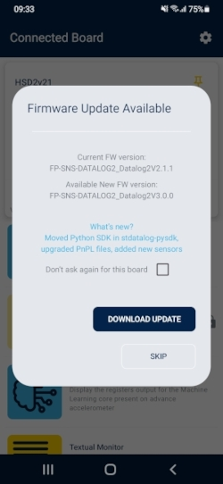

    Note: It is also possible to flash the firmware with [`STM32 Cube Programmer`](https://www.st.com/en/development-tools/stm32cubeprog.html) application on your PC.

3. Sensor configuration

    When your device is ready, click on the `HighSpeed DataLog2` widget to access the sensors selection page. Choose your desired sensors, in our case `Acceleromter (LSM6DSV16X)`, and configure both *Output Data Rate (ODR)* and *Full Scale*, for our example to 30 Hz and 8 g. To turn on the sensor simply use the `Enable` slide button.

    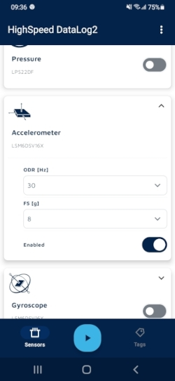

4. Logging Data

    To start collecting the data press the play `▶` button in the middle of the bottom bar.
    In the `Tags` folder it is possible to control data labeling and acquisition information, such as `Acquisition Name` and `Acquisition Description`.

    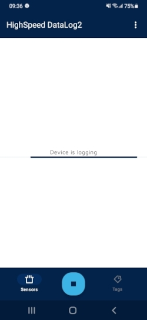
    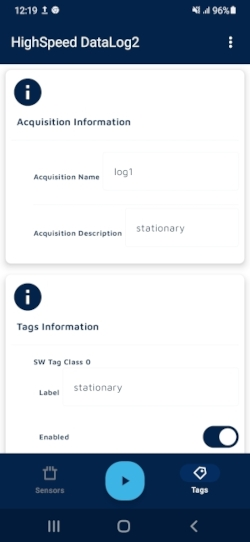
    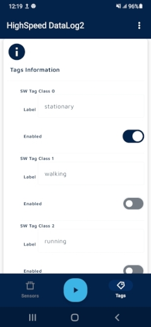

### SensorTile.Box PRO & ST AIoT Craft

The alternative data collection method for the `SensorTile.Box PRO` is with [`ST AIoT Craft`](https://staiotcraft.st.com/index.html). This example requires only a stable internet connection and the [FP-SNS-DATALOG2](https://www.st.com/en/embedded-software/fp-sns-datalog2.html) firmware.

1. Open ST AIoT Craft

    After opening the ST AIoT Craft tool web page you will see the home page with a navigation bar on the top. Go to `My datasets`.

    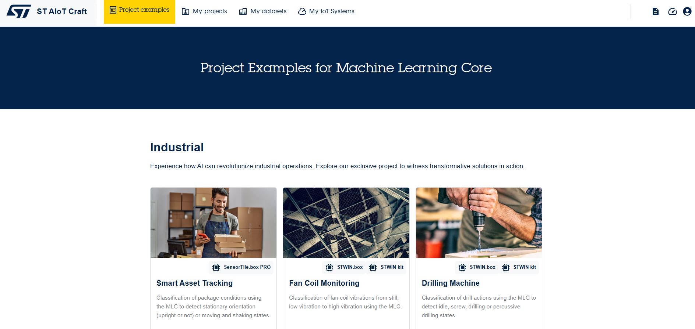

2. Create new dataset

    In `My datasets` you will see all of your created/cloned datasets. Create a new dataset by clicking the `Create new dataset` button in the top right corner.

    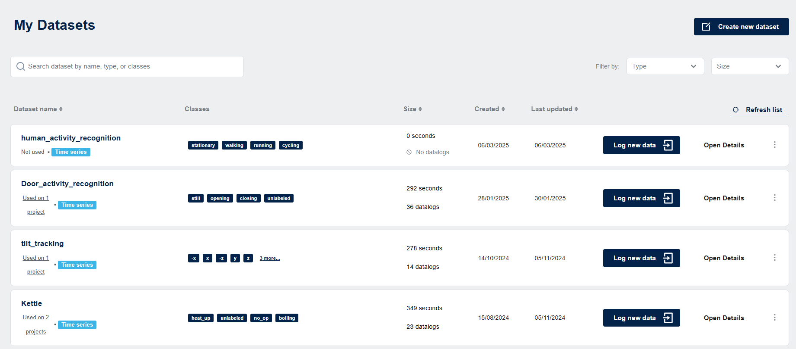

    In the next step insert the dataset details, such as *Name*, *Description* and *Classes*. It is not necessary to insert classes names, but it is recommended because they are used for further data classification and for building the MLC model. Then click on `OK`.

    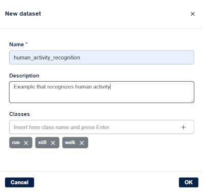

3. Log data from board

    Click on `Log data from board` in the top right corner of the dataset's home page.

    

    #### Flash High Speed Datalog firmware

    It is necessary to flash the High Speed Datalog firmware. If it is not already flashed, ST AIoT Craft is able to do so. When pairing your device click on `Update the firmware`. This will open the firmware update tool.

    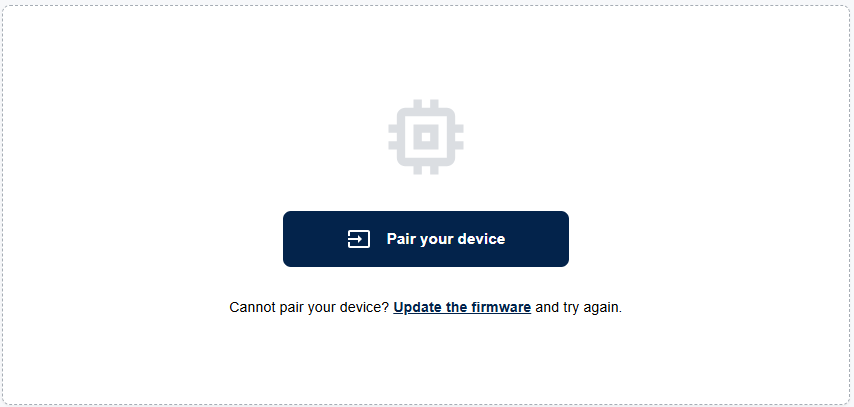

    The update consists of three steps:
    1. Connect the sensor device
    2. Turn on the device in DFU mode (turn on the device while holding down the user button)
    3. Flash the following firmware version on the device

    To flash the firmware click on `Flash firmware` button.

    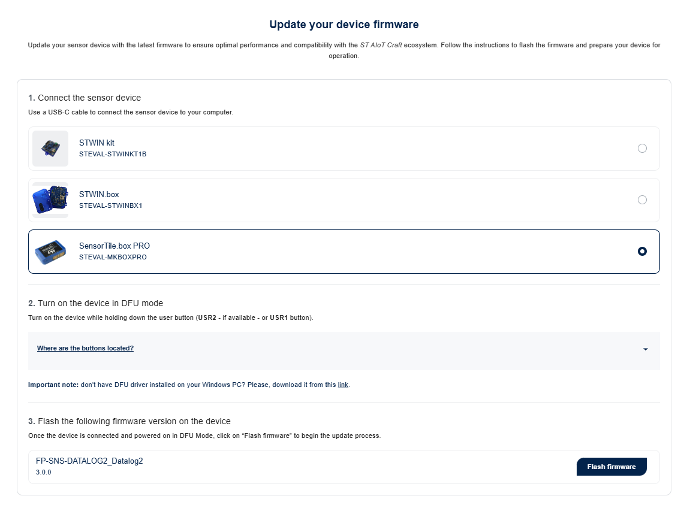

    When the firmware is successfully flashed, you will see your device information, such as:
    - Status (has to be DETECTED)
    - Board name
    - Firmware name
    - Package name

    Now connect the SensorTile.Box PRO by clicking on `Connect device`.

    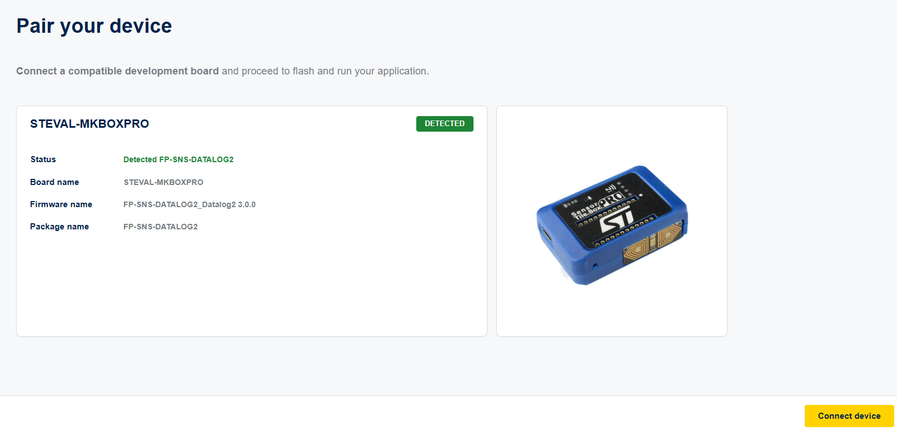

    When the device is connected, it is time for the sensor configuration. On the next page select `ACC(LSM6DSV16X)` in `Sensor Settings`. Configure Full Scale (FS) and Output Data Rate (ODR), 8 g and 30 Hz in our case.

    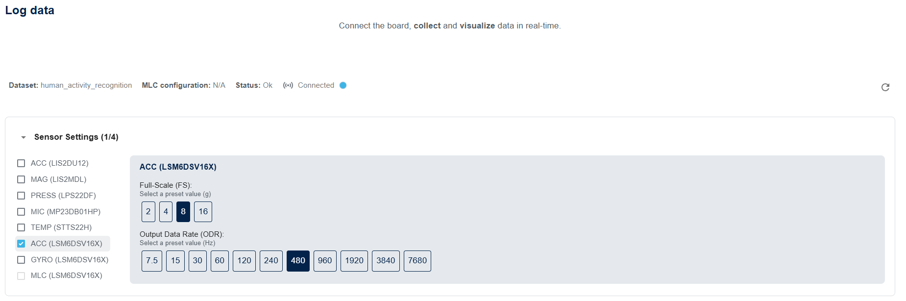

    Select mode `Datalogging` and click on `Start` button to start collecting data. It is possible to use predefined tags to classify live data. When using tags, each sample has to be at least 5 seconds long to be correctly classified.

    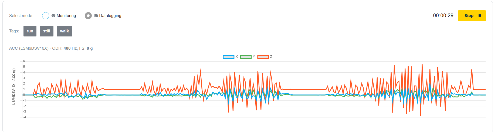

    When you stop collecting data. You will see the datalogging details:
    - Acquisition information
    - Board information
    - Balance of available logs for each class

    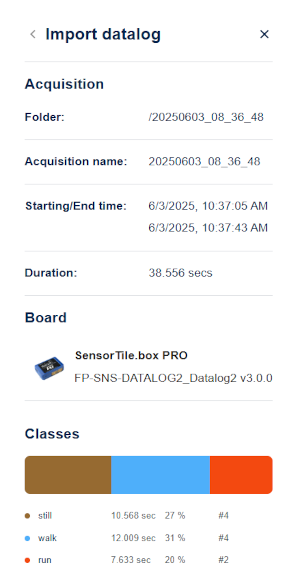

-----

**More information: [http://www.st.com](http://st.com/MEMS)**

**Copyright © 2025 STMicroelectronics**