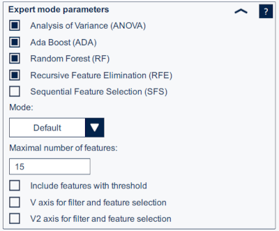

# Tutorial 2 - Import datalogs and automatic features selection

In this tutorial you will learn how to `Load Data Patterns` and use the `Automatic Filters & Features Selection (AFS) tool` in MEMS Studio.

## Machine learning core tool

The MLC tool in MEMS Studio enables users to configure the machine learning core embedded in certain devices. For further information about the MLC, please refer to the specific application note for the sensor you intend to use. Within the tool, the configuration process is structured in several steps, each displayed in separate tabs:

- `Data patterns`: Allows managing the data patterns to be used and assigning a label to each data pattern
loaded.
- `AFS tool`:  Allows processing the imported data and recommends window length, filters, and features that can be used for the decision tree generation.
- `ARFF generation`: Allows configuring inputs, filters, and features to generate an ".arff" file containing the computed features.
- `Decision tree generation`: Allows configuring and generating the decision tree(s).
- `Config generation`: Allows setting the metaclassifier and generating the configuration as a ".json" file.

To start configuring the machine learning core, the workspace directory must be selected using the `Browse` button. After that a device must be selected. If a sensor embedding the MLC is connected, it is selected automatically.

The entire MLC configuration is stored in the *MLC_settings.json* file inside the workspace directory. The changes are automatically saved to this file. The MLC configuration can be imported into the active workspace using the `Import` button.

## Load data patterns

The `Data patterns` tab allows managing the data patterns to be used for the machine learning processing. The data patterns must have the same format as log files generated by MEMS Studio.

Data patterns are selected using the `Browse` button. Multiple files can be selected at a time. A class label must be assigned to each data pattern. The class label is confirmed by the `Load` button.

Note: Each class has to be represented by one or more data logs in order to be classified by the decision tree. During data collection, it is important to acquire "clean" data, meaning that data from only one class must be present in each data log. For instance, when recording the class "walking", the walking has to start before recording and has to finish after recording stops. Also it is always recommended to have a balanced number of logs and overall amount of data for each class.

### Human activity recognition example

Let's start the MLC project loading the previously collected data patterns. This example will be demonstrated on a `Human activity recognition (HAR)` project. The sensor is configured with ±8 g *Full Scale* and 30 Hz *Output Data Rate*. This example recognizes 4 classes: *stationary*, *walking*, *running* and *cycling*.

First, click on `Browse` and select all datalogs for a class you want to add and insert a name in the `Class` textbox. Then click on `Load`: the loaded data patterns will appear in the `Data Patterns` table.

Several CSV logs are already available in the `data` folder and are sufficient to obtain good training results.

These logs have been originally obtained from a public HAR dataset named (Reiss, Attila. (2012). PAMAP2 Physical Activity Monitoring. UCI Machine Learning Repository. [https://doi.org/10.24432/C5NW2H](https://doi.org/10.24432/C5NW2H)) and later cleaned/pre-processed for the purpose of this tutorial.

## Automatic Filters and Features Selection (AFS) tool

The AFS tool offers the possibility to automatically estimate suitable window length, filters, and features for classification done by the decision tree.

Two methods can be used for the automatic filter selection:
- `Basic search` is a peak-based method that identifies the maxima of the signal in the frequency spectrum. This method is less computationally expensive, but it is not accurate on flat signals without significant peaks.
- `Exhaustive search` is an entropy-based method that searches all combinations of frequency bands (on a logarithmic scale) and selects the frequency of interest that minimizes the entropy against the other classes.

The automatic feature selection algorithm selects the top features by computing the rank of each feature averaging across all ensemble methods. There are five different ensemble methods available to determine feature importance: ANOVA, Ada Boost (ADA), Sequential Feature Selection (SFS), Random Forest (RF), Recursive Feature Elimination (RFE). By default, ANOVA, Ada Boost, Random Forest, and Recursive Feature Elimination are used. Including Sequential Feature Selection may improve the overall performance but increases the overall runtime.

The automatic filters and features selection can be found on the `AFS tool` page. MLC settings, inputs and AFS can be configured there.

Let's now focus on the AFS widget. In the first step it is necessary to configure the *AFS calculation* process where you choose what will be calculated. wW will stay with the default: window length, filters and features.

For more experienced users there is an additional `Expert mode parameters` section with advanced settings.

**Expert Mode parameters:**

First of all the single ensemble methods for features selection can be enabled or disabled.

Then, the `Mode` can be selected:
- Default
- Best
- Fastest

And lastly `Maximal number of features`, features with thresholds and norm (or norm squared) axis selections are available.

When the configuration is set, `Run` the AFS and wait until results show. Three new widgets will appear, `Calculated window length` with the best value computed for your project, `Calculated filters`, which shows which filters suit the best (with the filters <B, A> coefficients), and `Calculated features`, which shows a table overview with the recommended features. In the `AFS` widget choose which results you want to apply and click on `Apply to Settings`. The applied settings will apper on the next `ARFF generation` tab.

When the `AFS` settings are applied, in the `ARFF generation` tab click on `Generate AFRR File` and generate *features.arff* file. This file can be used in the following tutorials.

The *workspace* folder contains the *mlc_settings.json* and *features.arff* files generated with this tutorial as reference.

-----

**More information: [http://www.st.com](http://st.com/MEMS)**

**Copyright © 2025 STMicroelectronics**