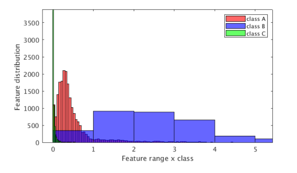
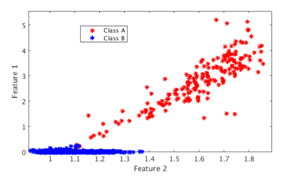
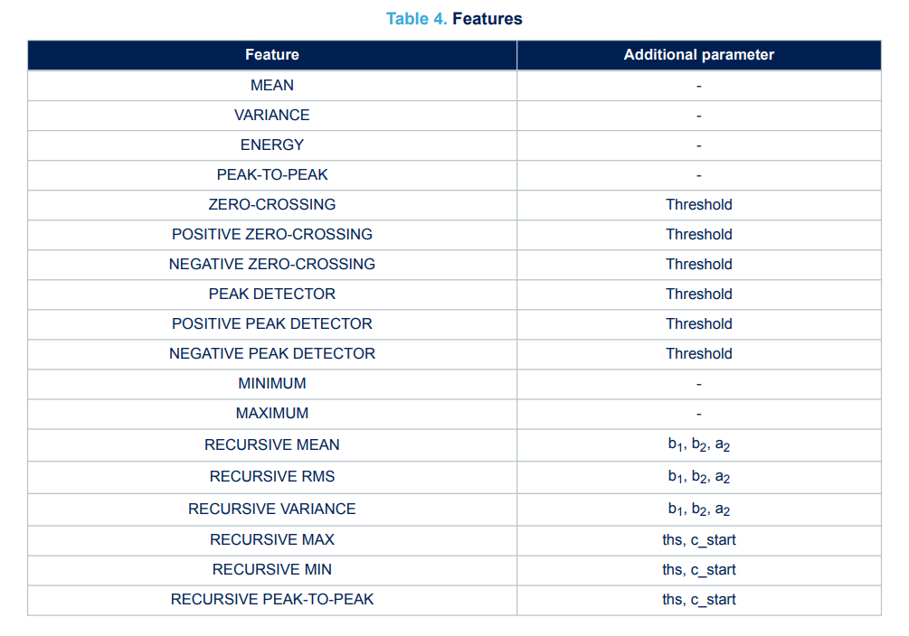
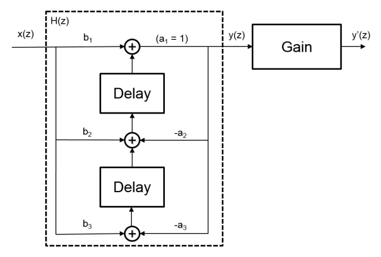
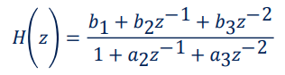
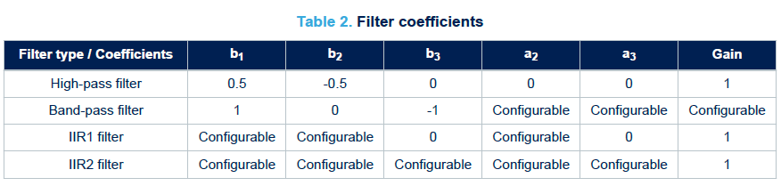
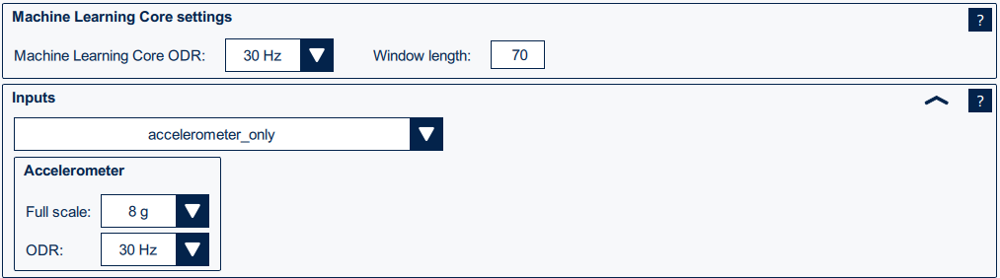
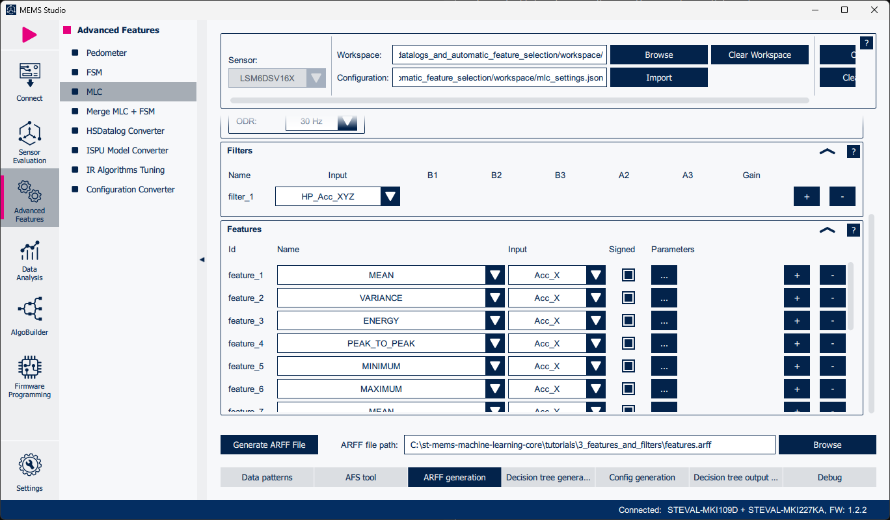
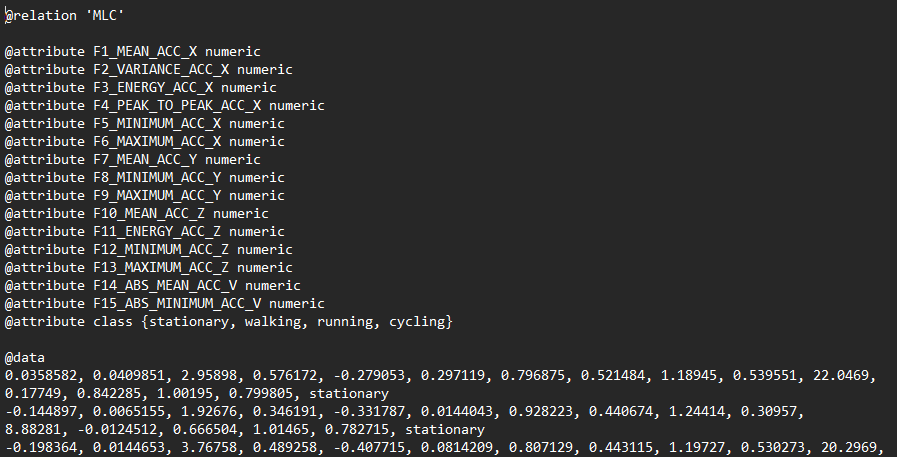

# Tutorial 3 - Features and filters selection

This tutorial provides a comprehensive guide to manual `Filters and Features` selection.

## Features selection

The machine learning core parameters are called “features” and can be used as input for a configurable decision tree that can be stored in the device. Features are statistical parameters derived from the sensor data. These features (such as mean, variance, energy, peaks, zero-crossing, and so on) are calculated over a defined time window, with a configurable `window length`, which is expressed in terms of number of samples. Selecting the appropriate window size is essential, as it significantly impacts ML processing. With the expection of the so called "recursive" features, all other statistical parameters in the decision tree are computed within this window. Comprehensive information about the features available for your selected sensor can be found in the specific application note.

When selecting the features consider that the use of too many features may lead to overfitting and too large decision trees, it is recommended to start first by selecting the four most common features:
- Mean
- Variance
- Energy
- Peak-to-peak

If the performance is not satisfactory with these features, and in order to improve the accuracy, other features can be considered to better separate the classes.

Input data for the features calculation (accelerometer, gyroscope) and axes (for example, X, Y, Z, V) have to be chosen according to the specific application as well. Some classes are strongly correlated with sensor orientation (that is, applications which use the device carry position), so it is better to use individual axis (X, Y, Z). Other classes (like walking) are independent of orientation, so it is better to use the norm (V or V2).

Sometimes the basic features (mean, variance, energy, and so forth) might not help in distinguishing the dominating frequency, so embedded digital filters can be enabled to select a specific region of frequency (see the section below dedicated to filters selection).

The information contribution from a single feature can be evaluated by a measure of how much different classes are separated. This analysis can be done in a graphical way, by plotting 1D/2D graphs as described in the following examples.

### Histogram of a single feature (1D plot)

The following figure shows a histogram of the computed values of a single feature for three different classes. These three classes are reasonably separated, so an important level of information is expected with this feature. For reference, the computed classification accuracy with this single feature is around 75%.

### Visualization of two features (2D plot)

The following figure shows a 2D plot related to a 2-class classification problem with the selection of two features:
- Feature 1 on the graph vertical axis
- Feature 2 on the graph horizontal axis

In this case, the strict separation between the two classes is evident:
- Class A in red
- Class B in blue

A good information contribution can be obtained by combining the two features. For reference, the classification accuracy obtained with this example is more than 95%.

See all the possible features the MLC tool offers in the following table:

Note: find more information about all the features in the application note [AN5804](https://www.st.com/resource/en/application_note/an5804-lsm6dsv16x-machine-learning-core-stmicroelectronics.pdf).

## Filters selection

The basic features such as mean, variance, and energy contain direct information from raw signal samples, but they might not be able to separate classes with different dominating frequencies. It is always possible, and in many cases suggested, to apply filters on raw signals to isolate specific information and separate classes more efficiently.

As an example, let us consider a `human activity recognition` problem. We can distinguish precisely if the user is walking (typically 1-2 Hz) or running (2.5 - 4 Hz) using appropriate filters. A Fourier analysis provides insight on which frequency region is dominating for each class.

This process involves the selection of a proper filter (low pass, high pass, bandpass) and the definition of the cutoff frequencies. Consider the case of energy as sole feature for the classification problem. The selection of filter and frequency of interest is done by finding, with FFT, the significant energy in the non-overlapping region between classes.

The basic element of the machine learning core filtering is a second order IIR filter, shown in the figure below.

The transfer function is the following:

The machine learning core tool asks for the filter coefficients needed after selecting the type of filter. The following table shows the configurable values for the coefficients, depending on the filter type chosen. By setting different coefficients, it is possible to tune the filter for the specific application.

## ARFF file generation in MEMS Studio

Features and filters can be manually selected in the `ARFF generation` tab of the MLC tool. First of all select basic MLC and sensor configuration such as:
- MLC ODR
- Window length
- Input sensor(s)
- Sensors configuration

The configuration values from the `AFS tool` can be used as described in the previous tutorial.

In the next step select the filters and features or apply the ones from the `AFS tool`.

Once all filters and features have been selected, click on `Generate ARFF file`. The attribute-relation *.arff* file will be saved in the initially selected *workspace*. The *.arff* file is divided into two sections: the header, which defines the attributes (features and classes), and the data section, which contains all the feature values along with their corresponding class labels associated with each set of features.

## Filters and features selection for human activity recognition

Let's have a look at manual filters and features selection for the `human activity recognition` example. Before selecting features or filters, you need to understand the data you are working with.

### Features selection

For the features selection the key is to identify features that are likely to differentiate the activities.

First of all, features that provide information about signal intensity and variability are the most useful: stationary will have a mostly stable signal, walking and cycling will have a moderate intensity, and running will have the highest intensity of all the classes. The following features are all valid choices:
- `VARIANCE`
- `ENERGY`
- `PEAK-TO-PEAK`

Walking and cycling may not be always distinguishable with signal intensity/variability alone, so it may be helpful to introuduce additional features, that provide a different type of information, more related to the frequency characteristics of the signal:
- `ZERO-CROSSING`
- `PEAK DETECTOR`

One other important aspect in features selection is to choose the input on which to compute them. In the case of this example of human activity recognition it could be worth considering using only features computed on the norm for the accelerometer (Acc_V), in order to make the solution orientation independent. However, exploiting features computed on the single axes (Acc_X, Acc_Y, Acc_Z) may lead to better accuracy; this is a good choice if you know that the device orientation will not change significantly in you application and that the data collected for the training of the MLC model covers all the expected variability.

### Filters selection

Filters can be beneficial in preprocessing sensor data for human activity recognition (HAR). They help remove noise, smooth signals, and extract meaningful information in specific frequency ranges, which is essential for accurate feature extraction and classification.

#### Low-pass filter

Removes high-frequency noise while retaining low-frequency components. Useful for smoothing accelerometer signals or extracting the gravity component from accelerometer data. Useful in removing noise from walking and running signals.

#### High-pass filter

Removes low-frequency components (e.g., gravity) while retaining high-frequency components. Useful for isolating dynamic motion (e.g., steps, running strides) by removing the gravity component. Helps in detecting rapid changes in activities.

#### Band-pass filter

Retains only a specific range of frequencies while removing others. Useful for isolating periodic activities like walking and running, which occur in specific frequency ranges (e.g., 0.5-3 Hz for walking, 2-5 Hz for running). Helps with differentiating walking from running based on frequency.

#### Calculating the B, A coefficients

To calculate the B, A coefficients, you can use variety of tools and libraries. Below is a list of commonly used tools and libraries for calculating filter coefficients:

1. Python
    - `SciPy`: The scipy.signal module is a powerful library for designing and analyzing digital filters.
2. MATLAB
    - `butter`: Designs Butterworth filters.
    - `cheby1` and `cheby2`: Design Chebyshev filters.
    - `ellip`: Designs elliptic filters.
    - `freqz`: Visualizes the frequency response of the filter.

-----

**More information: [http://www.st.com](http://st.com/MEMS)**

**Copyright © 2025 STMicroelectronics**