# Tutorial 4 - Decision tree generation

The `decision tree` is the predictive model, built from the training data, which can be integrated in the machine learning core. The training data are data logs acquired for each class to be recognized.

Each node of the decision tree contains a condition, where a feature is evaluated against a certain threshold. If the condition is true, the next node in the true path is evaluated. If the condition is false, the next node in the false path is evaluated. The status of the decision tree evolves node by node until a result is found. The result of the decision tree is one of the classes defined at the beginning of the data collection.

The decision tree generates a new result every time window (the parameter "window length" set by the user for the computation of the features).

## Human activity recognition example

Let's generate a decision tree for the `human activity recognition` use case.

First of all let's load the prepared sensor and MLC configurations.

### Sensor configuration upload

To load the sensor configuration go to the `Sensor Evaluation` tab and select the `Load/Save Configuration` tool.

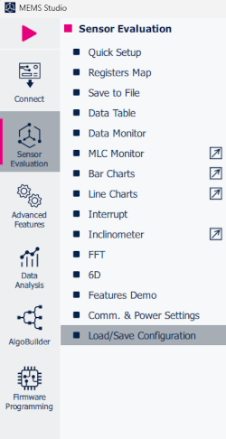

In `Load Configuration` section click on `Browse` and select sensor configuration file you want to use for the MLC. We will use the configuration we prepared in section *Professional MEMS tool & MEMS Studio* of **Tutorial 1 - Tools and data collection**.

### MLC configuration upload

To upload MLC the configuration go to `Advanced Features` tab and select `MLC` tool. There click on `Import` button and choose your MLC configuration file. We will use *mlc_settings.json* configuration file that we created in **Tutorial 2 - Import datalogs and automatic features selection**. You can regenerate the arff file or copy it from tutorial 2.

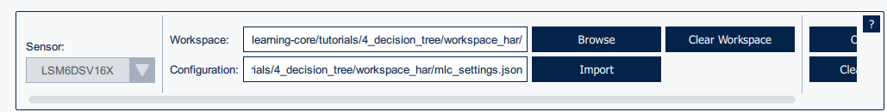

The sensor and MLC configuration files can be found in the corresponding tutorial folders.

Now go to the `Decision tree generation` tab and choose a number of decision trees you want to generate (up to 4 for LSM6DSV16X). For each decision tree select:
- `Max depth`: Maximum depth of the decision tree. This can help with reducing the decision tree size.
- `Min leaf samples`: Minimum number of data samples being classified by a specific leaf. Increasing this value can help with reducing overfitting.
- `Percentage of data to use for training`: It can used to exclude some of the data from the training of the decision tree.

`Update Features Mapping` button: if the user imports a decision tree, a feature mapping is needed to map every feature selected during the arff generation to the features used in the decision tree file. Note that this mapping is applied for all decision trees.

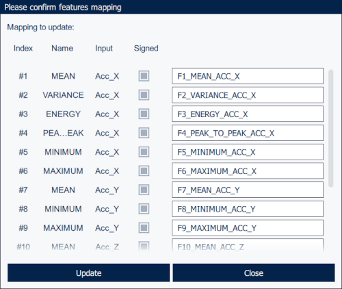

When all these parameters are set, click on the `Generate Decision Tree` button to generate the decision tree file.

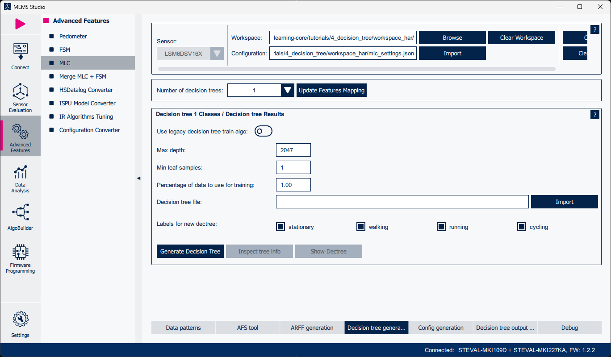

Note: If you have already created your own decision tree, click on `Import` and select the decision tree ".txt" file you want to import.

You will see the results for each decision tree in the corresponding widget, including:
 - `Classification accuracy`: The higher the percentage is, the better the decision tree classification ability.
  - `Confusion matrix` - An NxN matrix that summarizes how successful the classification model predictions are, that is, the correlation between the label and the model classification. One axis of a confusion matrix is the label that the model predicted, and the other axis is the actual label.

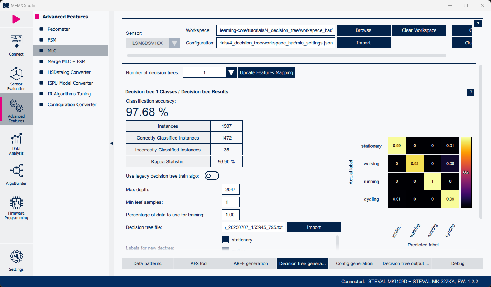

### Inspect tree info

It is possible to inspect tree information directly from MEMS Studio. Click on `Inspect tree info` button to show the generated decision tree file. Every decision tree file consists of:
- `Decision tree structure`: The first part of the file shows the structure of the decision tree. Each line represents describes a condition on a particular feature, and includes the output class if it is leaf.
- `Tree Statistics`: This section provides statistics about the decision tree, such as the number of leaves and the size of the tree.
- `Classes`: List of the different classes that the decision tree can predict.
- `Features`: List of all the features used in the decision tree.
- `Complete training data statistics`: This section shows the all the statistics relative to the trained decision tree.

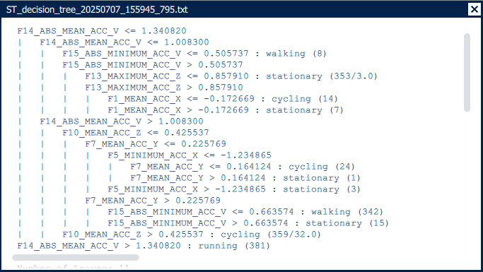
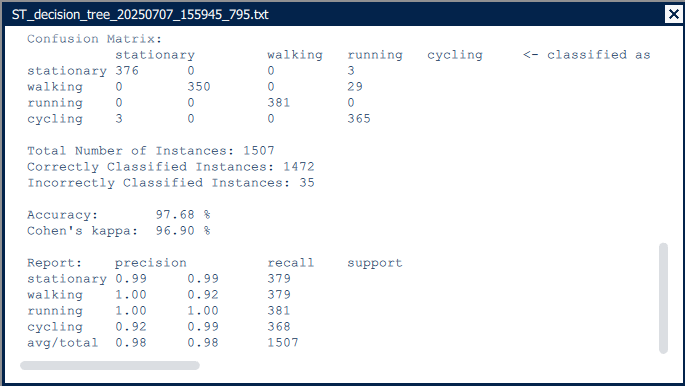

### Show decision tree graph

MEMS Studio offers a graphical visualization of the generated decision tree. Click on `Show Dectree` to display it. It is also possible to export the decision tree to *.png* format.

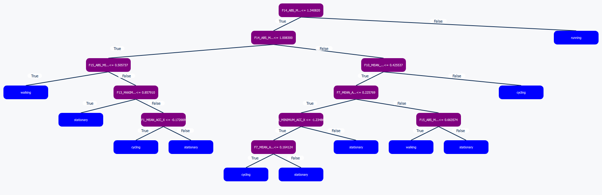

### Metaclassifiers

After the decision tree is generated / imported, moving to the `Config generation` tab allows configuring the meta-classifiers. A `meta-classifier` is a filter of the outputs of the decision tree, which aims at making the outputs more stable. The meta-classifier uses some internal counters in order to filter the decision tree outputs. Two parameters are customizable for each decision tree:
- `Class output values`: Assigns an MLC outupt value to each class.
- `End counter`: Configures the metaclassifier threshold to increase prediction stability.

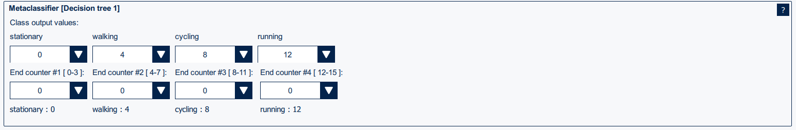

When all the parameters are set, click on the `Generate Config File` button: this will generate *mlc.json* file to your workplace folder. It is possible to load the configuration directly into the sensor by clicking on the `Load Config into Sensor` button, or export the configuration as a *.h* header file by clicking on the `Export As` button.

### Decision tree output viewer

MEMS Studio provides a live decision tree output chart, enabling users to monitor multiple decision trees simultaneously in real time. The figure below illustrates a live chart example for the *human activity recognition* configuration.

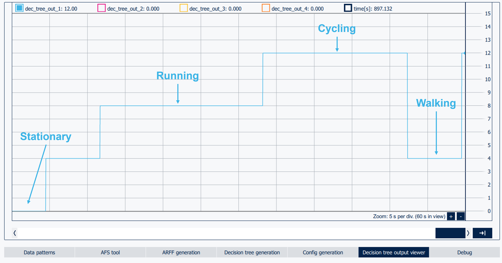

### Debug

The `Debug` tab is a tool that helps the user to test the MLC configuration with known data. Input the `Device configuration` file, that contains the device and MLC configuration, in our case the *mlc.json* file and the `Log file`. The debug tool will go through the provided data and show every MLC status change and decision tree output for every row of data.

When both files are ready, press the `▶` button to start the debug session.

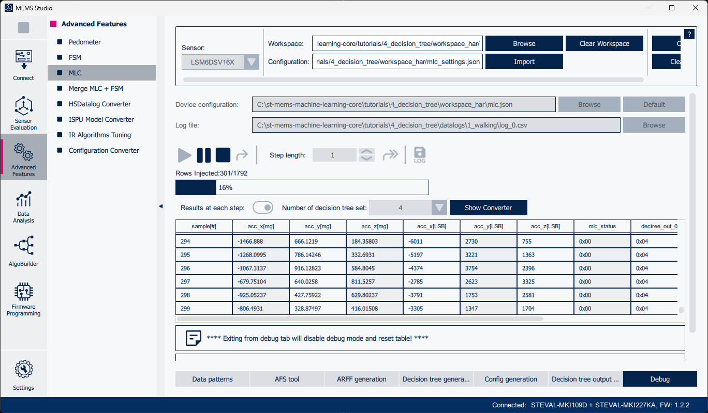

Once the debug session is over, every MLC status change is related to a change of the decision tree output value. These changes are highlighted in the data table. Every status change means there is a new interrupt generated.

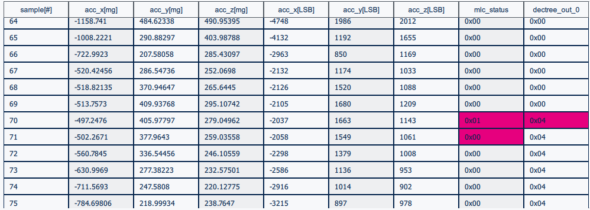

### MLC interrupt generation

Every time the MLC changes the output of the decision tree, an interrupt is generated. It is possible to track the interrupt generation using the `Interrupt` tool in the `Sensor Evaluation` tab. The interrupt page consists of two parts. The first part consists of live graphs, in this case graph of the accelerometer and interrupts. The second part allows the user to change the sensor interrupts configuration.

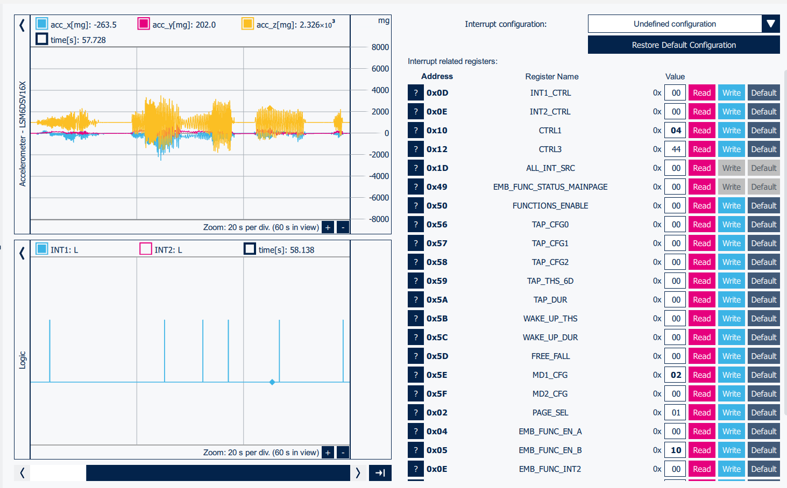

## Multiple decision trees

The `LSM6DSV16X` sensor supports up to 4 decision trees at a time. When using multiple decision trees, all the attributes described in the previous sections (inputs, filters, features computed in the time window, the time window itself, and also the data rates) are common for all the decision trees.

### Face-up/face-down + motion intensity example

Let's create two decision trees, one for *motion instensity* and the second one for *face-up/face-down* detection.

#### 1. Sensor evaluation

First of all configure the sensor using `Quick Setup` in `Sensor Evaluation`. For details refer to **Tutorial 1 - Tools and data collection**.

LSM6DSV16X configuration:
- Output Data Rate: 15 Hz
- Full Scale: 2 g
- Gyroscope: Power-down
- Qvar: Off

#### 2. Import datalogs

Have a look at **Tutorial 1 - Tools and data collection** to see how to collect the data. Pre-collected datalogs for both examples are available in the *datalogs* folder.

To import datalogs into MEMS Studio use the `Data patterns` tab in the `MLC` tool. A detailed step-by-step tutorial on how to import datalogs into MEMS Studio is available in **Tutorial 2 - Import datalogs and automatic features selection**.

#### 3. ARFF file generation

After successfully importing the datalogs, it is time to apply `Features & Filters`. In the `AFS tool` tab run the AFS tool and apply the results to the settings.

It is possible to customize the automatically selected features and filters in the `ARFF generation` tab before generating the *.arff* file. When satisfied with the setup, generate the ARFF file.

More information about how to use AFS or how to select features & filters manually can be found in **Tutorial 2 - Import datalogs and automatic features selection** and **Tutorial 3 - Features and filters**.

#### 4. Generate two decision trees

Finally, let's generate the two decision trees. Set the *Number of decision trees* to 2. Two widgets will pop-up, one for each decision tree. For each tree select the labels to be recognized. For the first one select *intensity* labels and for the second one select *face up/face down* labels. Then generate both decision trees and see the results.

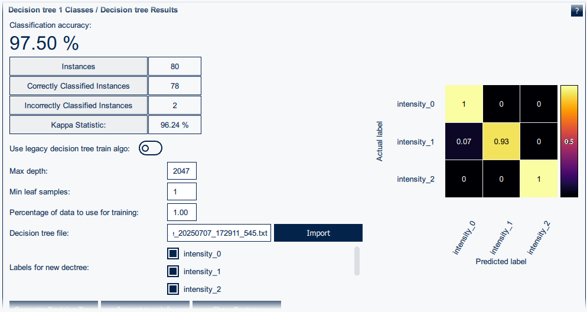
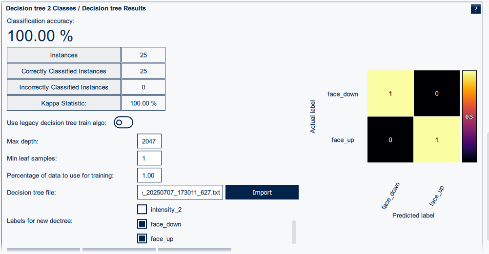

After generating the two decision trees, proceed to the `Config Generation` tab to assign the MLC output values to each class and configure the meta-classifiers for both decision trees. Finally, as previously described, clicking the `Generate Config File` button will create the *mlc.json* file with the MLC configuration and save it to your workspace folder.

All configuration files can be found in the *workspace_multiple_trees* folder.

-----

**More information: [http://www.st.com](http://st.com/MEMS)**

**Copyright © 2025 STMicroelectronics**