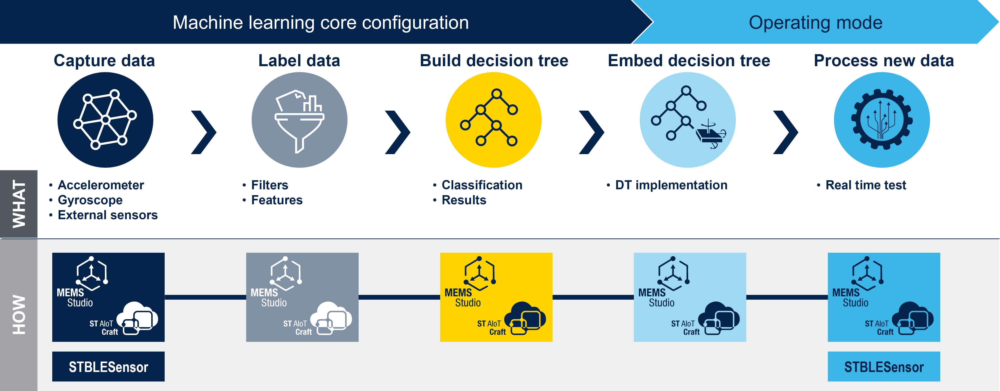

# Tutorials

This folder contains tutorials designed to equip you with the fundamental principles of machine learning and teach you how to apply them in developing configurations for the machine learning core (MLC). Additionally, you will gain insights into utilizing the hardware and software tools provided by ST that support this process.

Whether you are a beginner seeking to grasp the basics or an experienced practitioner looking to expand your expertise, these tutorials will help you to seamlessly integrate your models into sensors equipped with the MLC and bring your applications to life.

The graphic below illustrates the workflow for implementing the five key steps of development of an MLC solution, along with the various software tools available. This guide will take you through important topics, including data logging, filters and features selection, decision tree creation, and validation. Each tutorial is designed to be hands-on, providing clear, step-by-step instructions.

By the end of these tutorials, you will be able to understand and replicate each step for your own application.

## Tutorials overview

- [Tutorial 1 - Tools and data collection](./1_tools_and_data_collection/): Introduction to essential hardware and software tools, and data collection.
- [Tutorial 2 - Import datalogs and automatic features selection](./2_datalogs_and_automatic_feature_selection/): Learn how to import datalogs in MEMS Studio, and how to use AFS to select filters and features.
- [Tutorial 3 - Features and filters](./3_features_and_filters/): Learn how to manually choose window length, features, and filters.
- [Tutorial 4 - Decision tree generation](./4_decision_tree/): Learn how to generate MLC decision trees.

------

**More information: [http://www.st.com](http://st.com/MEMS)**

**Copyright © 2025 STMicroelectronics**
